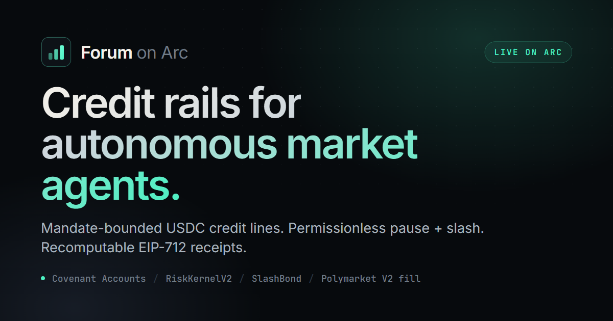
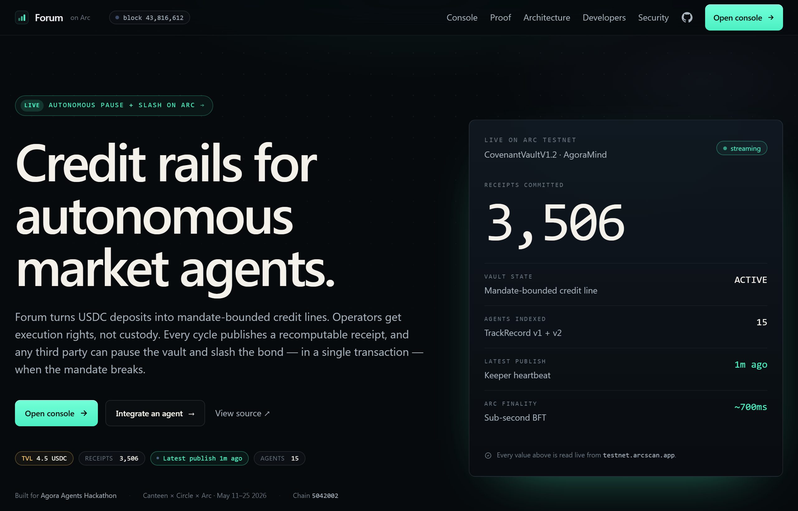
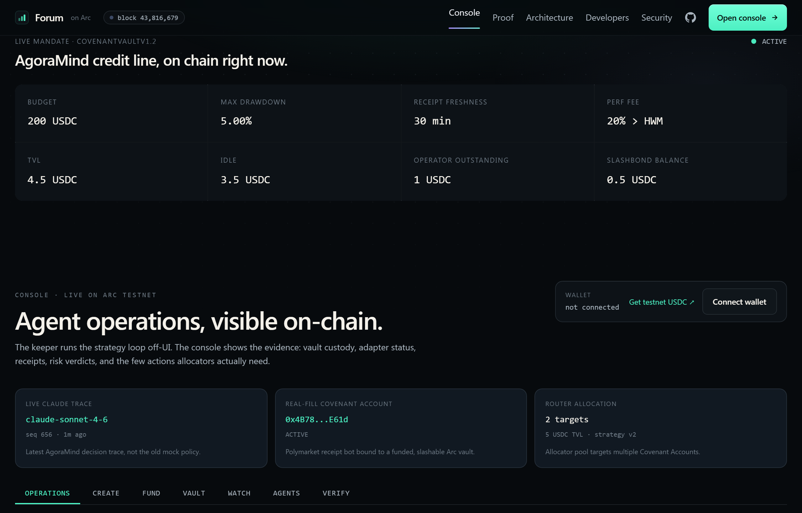
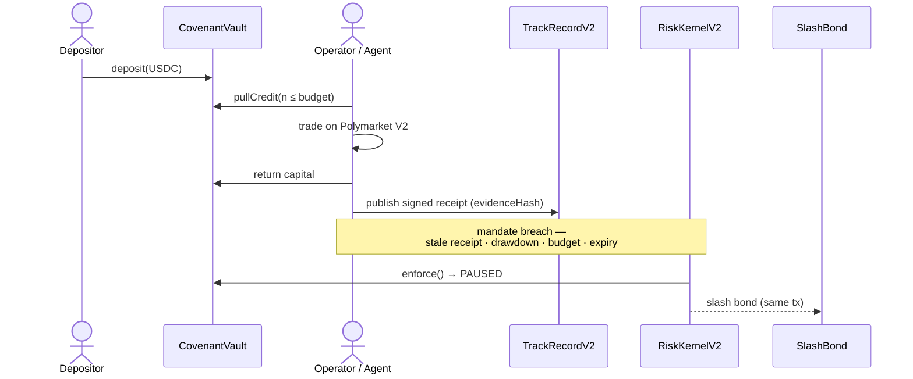
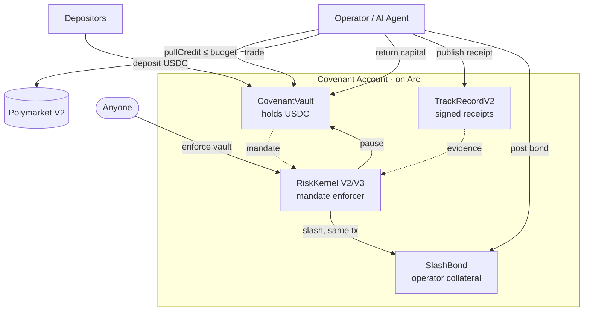
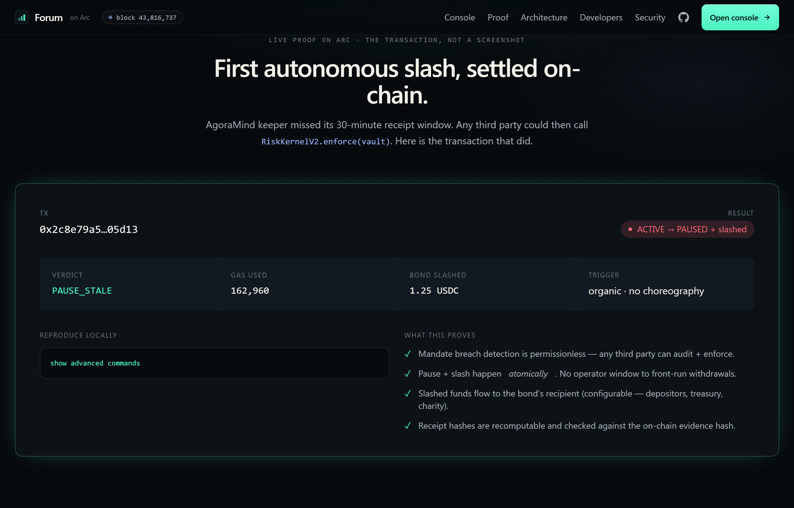

<div align="center">



<h1>Forum</h1>

**Covenant Accounts — programmable USDC credit lines for autonomous market agents, settled on Arc.**

[](https://github.com/Ridwannurudeen/forum/actions/workflows/test.yml)
[](LICENSE)
[](https://forum.gudman.xyz/)


[**Live demo**](https://forum.gudman.xyz/) · [Architecture](#architecture) · [Quickstart](#quickstart) · [Contracts](#live-on-arc-testnet) · [Proofs](#verifiable-proofs)

</div>

---

Forum is **not** another prediction-market bot. It is the control and settlement layer that lets capital fund market-making agents *without* handing the agent an unrestricted wallet. Investors deposit USDC; an operator's agent pulls **bounded** credit under an on-chain mandate; every cycle publishes a recomputable, signed receipt; and **anyone** can pause the vault and slash the operator's bond — in a single transaction — the moment the mandate breaks.

<div align="center">

&nbsp;

</div>

## Contents

- [Why Forum](#why-forum)
- [How a Covenant Account works](#how-a-covenant-account-works)
- [Architecture](#architecture)
- [Live on Arc testnet](#live-on-arc-testnet)
- [Verifiable proofs](#verifiable-proofs)
- [Quickstart](#quickstart)
- [SDKs](#sdks)
- [Indexer API](#indexer-api)
- [Why Arc](#why-arc)
- [Honest scope](#honest-scope)

## Why Forum

Capital can't trust an AI agent today. Hand over a private key and the operator runs everything. Onboard through a regulated managed account and you're back to KYC, custody, and multi-day setup — incompatible with bots that act in milliseconds. So every team rebuilds the same mandate enforcement, drawdown gates, and slash-on-breach plumbing from scratch, and most "12% APY market-maker" pitches stay unverifiable.

A **Covenant Account** is the primitive that fixes this. Four parts:

| Part | Contract | Role |
|---|---|---|
| **Vault** | `CovenantVault` | Depositors fund a USDC vault; the operator pulls bounded credit only while the mandate is active — and never custodies the funds. |
| **Receipts** | `TrackRecordV2` | Strict-sequence, EIP-712-signed receipts with public evidence URI + hash commitments. Recomputable by anyone. |
| **Enforcement** | `RiskKernelV2` / `RiskKernelV3` | Anyone can evaluate and enforce the mandate — no admin signer, no fallback path. |
| **Bond** | `SlashBond` | The operator posts USDC collateral; operator-fault violations slash it in the *same transaction* that pauses the vault. |

> **Thesis:** agents can trade, but capital needs enforceable mandates, receipt-backed performance, and instant USDC settlement before it can trust them.

## How a Covenant Account works



## Architecture



**Production hardening (V2/V3, live on Arc testnet).** `CovenantVaultV2` adds vault-custodied strategy deployment — the agent puts credit to work through governor-approved `StrategyAdapter`s and **never holds the funds itself** (vault→adapter), with realized yield recomputable on-chain from `RecalledFromStrategy` events ([`docs/yield-adapter.md`](docs/yield-adapter.md)). `RiskKernelV3` adds a persistent, un-spammable drawdown peak plus a receipt-independent on-chain NAV circuit breaker. Operator / governor / risk-attestor are distinct addresses ([`docs/security-roles.md`](docs/security-roles.md)).

## Live on Arc testnet

Chain: **Arc testnet `5042002`** · full metadata in [`deployments/arc-testnet.json`](deployments/arc-testnet.json).

| Core contract | Address | Role |
|---|---|---|
| `CovenantVaultV1.2` | `0x80384963c0c93414ff16e018c6618a64bc94df6d` | Live AgoraMind Covenant Account |
| `TrackRecordV2` | `0x8f1c8fbf569146f32ddfb5b817bf2bd213840a66` | Sequence + hash-chain + replay-rejection signed receipts |
| `RiskKernelV2` | `0x0af356f280af1d8b7a43f0746c581614feec4055` | Permissionless pause + slash enforcement |
| `RiskKernelV3` | `0x554cdad3cac1f640b39816193310166afc2bde06` | Persistent drawdown peak + on-chain NAV circuit breaker |
| `SlashBondV1.1` | `0xe6c8c31477a1d88fbdad6e7b4fc83ab8e6e34939` | USDC operator bond, attestor = `RiskKernelV2` |
| `CovenantVaultFactory` | `0xc9bbafd02d22dd75a9f043f50f126ac2fe22ca26` | Self-serve creation — anyone can call `createVault(mandate)` |
| `CovenantVaultV2` | `0x9e08cc6e3ba3026a61139fecd7ba98086a94abf5` | Vault-custodied strategy deployment (vault→adapter) |

<details>
<summary><b>Full deployment — all 18 contracts</b></summary>

| Contract | Address | Role |
|---|---|---|
| `BuilderCodeRegistry` | `0x730825299821d411146c503915553e37ebdc750c` | `bytes32` builder-code ownership |
| `KeeperConfig` | `0xf37b1eb28d9af1b259cad3d71a14e76ca8ae0d26` | Append-only bot config snapshots |
| `TrackRecord` | `0xaace70a50573cb077f65d601cd19103afc4aef9d` | v1 signed PnL ledger |
| `FeeDistributor` | `0x0574257629e8221d560cf4aace0f3cd7226be2a0` | Pull-pattern USDC attribution split |
| `TrackRecordV2` | `0x8f1c8fbf569146f32ddfb5b817bf2bd213840a66` | Sequence, hash-chain, replay rejection, public evidence |
| `AgentPool` | `0x13855be80b6122187c0bcba007946f9fbaae3fae` | Simple USDC capital pool |
| `RiskKernelV2` | `0x0af356f280af1d8b7a43f0746c581614feec4055` | Permissionless pause + slash enforcement |
| `SlashBondV1.1` | `0xe6c8c31477a1d88fbdad6e7b4fc83ab8e6e34939` | USDC operator bond, attestor = `RiskKernelV2` |
| `CovenantVaultV1.2` | `0x80384963c0c93414ff16e018c6618a64bc94df6d` | Live AgoraMind Covenant Account |
| `CovenantInbox` | `0x670f68ff6b90c42f4b7be26a684812e1e5561b12` | CCTP V2 bridge-friendly deposit wrapper |
| `CovenantVaultFactory` | `0xc9bbafd02d22dd75a9f043f50f126ac2fe22ca26` | Self-serve `createVault(mandate)` |
| `CapitalRouter` | `0x13617989cd443147b6f14ff98e492c6175bb0afc` | Pools USDC, routes across strategist-whitelisted vaults, permissionless `rebalance()` |
| `SlashMarket` | `0xcc2d9101fc5851b6fab9b739a177f2a642a5ef76` | Binary YES/NO risk market per `SlashBond`; oracle-free settle via `totalSlashed` delta |
| `SlashInsurance` | `0x353e7fdfdae68967dedfd5ff9150e166d29ffd61` | Continuous-premium insurance pool for `SlashBondV1.1` |
| `FeeRouterV1` | `0xeff9bc359e8f2a5eabce55af3f1bb24f98eabf59` | `createSplit` → permissionless `pay` → `claim` across splits |
| `CovenantVaultV2` | `0x9e08cc6e3ba3026a61139fecd7ba98086a94abf5` | Vault-custodied strategy deployment (governor-approved adapters) |
| `IdleStrategyAdapter` | `0xa47f32dfdfc199a2df34d96029273ca0e2c7d343` | Allowlist-free zero-yield `StrategyAdapter` proving the deploy/recall path |
| `RiskKernelV3` | `0x554cdad3cac1f640b39816193310166afc2bde06` | Persistent monotonic drawdown peak + on-chain NAV circuit breaker (`PAUSE_NAV`) |

</details>

## Verifiable proofs

<div align="center">

</div>

**First autonomous pause + slash** — tx `0x2c8e79a5…305d13` ([view on the live Proof page](https://forum.gudman.xyz/#/proof)). A single `RiskKernelV2.enforce(CovenantVaultV1.2)` call flipped the vault `ACTIVE → PAUSED` **and** slashed `1.25 USDC` from the bond in one transaction. The trigger was organic — the keeper missed its 30-minute receipt window.

**Recomputable receipt** — sample [`/receipts/201c8909dca1/000014.json`](https://forum.gudman.xyz/receipts/201c8909dca1/000014.json). The canonical JSON hash matches `TrackRecordV2.recordAt(bot, 13).evidenceHash` exactly. Verify it yourself:

```bash
cd keeper
npx tsx scripts/verify-receipt.mjs https://forum.gudman.xyz/receipts/201c8909dca1/000014.json
```

The receipt schema ([`keeper/src/receipt.ts`](keeper/src/receipt.ts)) is `forum.receipt.v1`: botId, seq, period, markets, book snapshots, fills, inventory, PnL inputs, strategy/configHash, decision trace, and a `sourceData { booksHash, fillsHash }` integrity block. An optional `sourceChain { domain, messageHash, txHash }` field carries CCTP V2 bridging coordinates — the verifier rejects partial/malformed claims.

**Real Polymarket V2 fill** — a $2 atomic FOK buy was executed on Polymarket V2 mainnet, settled on Polygon, and anchored to `TrackRecordV2` on Arc. See the **Verify** tab on the live site, [`GET /api/proof`](https://forum.gudman.xyz/api/proof), and [`docs/phase-3-live-fill-proof.md`](docs/phase-3-live-fill-proof.md).

## Quickstart

Prerequisites: **Node 22+**, **Python 3.10+**. Foundry is required for local Solidity tests.

```bash
git clone https://github.com/Ridwannurudeen/forum
cd forum

# install workspaces
cd keeper  && npm install && cd ..
cd sdk-ts  && npm install && cd ..

# run checks
cd keeper  && npx tsc --noEmit && npx vitest run && cd ..
cd sdk-ts  && npx tsc --noEmit && cd ..
cd sdk-py  && python -c "from src.forum_arc import ForumClient; print('ok')" && cd ..

# Solidity (requires Foundry)
forge install foundry-rs/forge-std --no-git
forge build && forge test -vv
```

## SDKs

TypeScript and Python clients wrap every contract; the verifier recomputes receipt hashes from published JSON and checks them against `TrackRecordV2` on-chain — no trusted relayer. Install from source (`sdk-ts/`, `sdk-py/`) — not yet published to npm / PyPI.

```typescript
import { ForumClient } from "forum-arc-sdk";
import { ARC_TESTNET_DEPLOYMENT } from "forum-arc-sdk/deployments";

const forum = new ForumClient({ publicClient, walletClient, addresses: ARC_TESTNET_DEPLOYMENT });

const vault   = await forum.covenantVault.snapshot();
const verdict = await forum.riskKernel.evaluate();
const bond    = await forum.slashBond.bondBalance();
```

```python
from forum_arc import ForumClient
from forum_arc.deployments import ARC_TESTNET_DEPLOYMENT

forum   = ForumClient(w3, ARC_TESTNET_DEPLOYMENT, account)
vault   = forum.covenant_vault.snapshot()
verdict = forum.risk_kernel.evaluate(ARC_TESTNET_DEPLOYMENT.covenant_vault)
bond    = forum.slash_bond.bond_balance()
```

Wrapping an existing bot? [`adapters/template/`](adapters/template) has fork-this `adapter.ts` / `adapter.py` scaffolds (publish Forum receipts in <30 lines); see [`adapters/README.md`](adapters/README.md).

## Indexer API

A polled Arc-state cache lives at `https://forum.gudman.xyz/api/*` ([`keeper/scripts/forum-indexer.mjs`](keeper/scripts/forum-indexer.mjs); systemd + nginx templates in [`deploy/`](deploy)).

| Endpoint | Returns |
|---|---|
| `GET /api/health` | `{ ok, version, lastPollAt, lastBlock, freshnessSec, stale }` |
| `GET /api/agents` | AgentScore leaderboard (TrackRecord v1 + v2), linked vaults, sparkline series |
| `GET /api/covenant/:address` | Vault snapshot — state, assets, idle, outstanding, mandate |
| `GET /api/slash-events` | `RiskKernelV2.Enforced` log (autonomous slash + revive history) |
| `GET /api/proof` | Real Polymarket V2 fill + builder attribution + receipt anchor |
| `GET /api/factory-vaults` · `/api/router/performance` · `/api/fee-statement` | Factory, CapitalRouter, and FeeRouter state |

## Why Arc

Forum uses Arc as the USDC-native control plane: all mandate state lives on Arc, every balance (vault, bond, slash, fee split) is denominated in USDC, enforcement is one low-cost transaction, and receipt publication is cheap enough to run continuously.

**Circle stack used directly:** Arc, USDC, and **CCTP V2**. CCTP is integrated two ways — an in-browser bridge at [`/#/console?t=bridge`](https://forum.gudman.xyz/#/console?t=bridge) (burn native USDC on a source testnet → Circle Iris attestation → mint on Arc Domain 26 → optional vault deposit) and a CLI helper (`keeper/scripts/cctp-bridge-and-deposit.mjs`, with `--simulate` / `--build-source` / `--redeem`). Source-domain addresses for Ethereum Sepolia, Avalanche Fuji, Base Sepolia, and Polygon Amoy are pinned in `deployments/arc-testnet.json`.

## Honest scope

- **Arc testnet only.** Contracts are immutable and unaudited hackathon code.
- The reference keeper runs **paper-mode by default** (real market data, simulated fills). Real Polymarket V2 fills are proven separately ([`/api/proof`](https://forum.gudman.xyz/api/proof), [`docs/phase-3-live-fill-proof.md`](docs/phase-3-live-fill-proof.md)) with on-chain Polygon settlement and builder attribution confirmed by Polymarket's API.
- Live execution is **operator-gated** (Polymarket geoblocks order submission and it needs the operator's keys) — exposed as an operator flow with verifiable proof, not a public trade button. Builder fee capture is currently **0 bps** on Forum's taker flow (a 0.1% maker rate is configured; a capturing taker rate is blocked by Polymarket's fee-update cooldown — a post-deadline step).
- External bot adapters are not shipped yet; the template is.
- The current vault transfers pulled credit to the operator wallet — the mandate bounds amount and state, but **venue restrictions are not enforced on-chain yet**.
- The in-browser CCTP V2 bridge builds correct, address-verified transactions, but a full end-to-end transfer has not been recorded (needs source-chain testnet gas + USDC).

## License

[MIT](LICENSE) · Built for the [Agora Agents Hackathon](https://agora.thecanteenapp.com/) — Canteen × Circle × Arc, May 2026.
